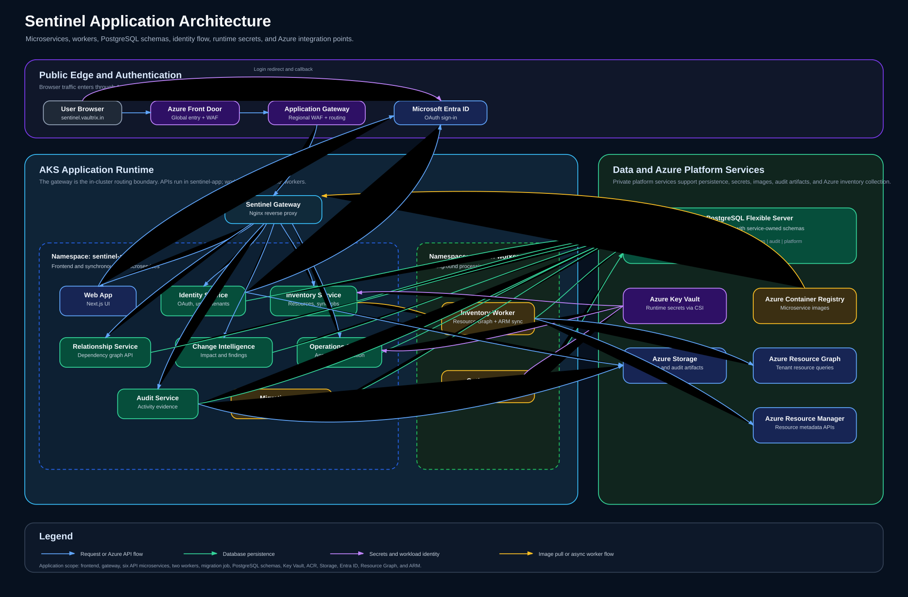
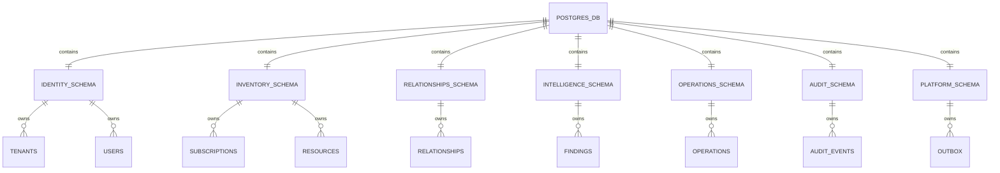
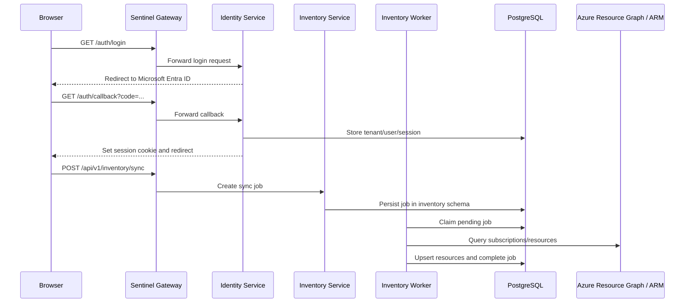

# Sentinel Application Architecture

## Purpose

This document describes the application-level architecture of Sentinel: the web
client, API microservices, background workers, shared platform libraries, and
PostgreSQL database schemas. It focuses on how the application is structured inside
AKS and how each service owns its data.



## High-Level Application View

```mermaid
flowchart TB
    user[User / Browser]
    entra[Microsoft Entra ID]

    subgraph edge["Azure Edge"]
        afd[Azure Front Door + WAF]
        appgw[Application Gateway + WAF]
    end

    subgraph aks["AKS Cluster"]
        gateway[Sentinel Gateway<br/>Nginx reverse proxy]
        web[Web App<br/>Next.js frontend]

        subgraph appns["sentinel-app namespace"]
            identity[Identity Service]
            inventory[Inventory Service]
            relationship[Relationship Service]
            intelligence[Change Intelligence Service]
            operations[Operations Service]
            audit[Audit Service]
            migration[Database Migration Job]
        end

        subgraph workerns["sentinel-workers namespace"]
            inventoryWorker[Inventory Worker]
            outboxRelay[Outbox Relay]
        end
    end

    subgraph data["Data and Platform Services"]
        postgres[(Azure PostgreSQL Flexible Server<br/>Sentinel database)]
        kv[Azure Key Vault<br/>runtime secrets]
        acr[Azure Container Registry<br/>application images]
        storage[Azure Storage<br/>login/audit artifacts]
        graph[Azure Resource Graph]
        arm[Azure Resource Manager]
    end

    user --> afd --> appgw --> gateway
    gateway --> web
    gateway --> identity
    gateway --> inventory
    gateway --> relationship
    gateway --> intelligence
    gateway --> operations
    gateway --> audit

    web -->|Microsoft sign-in redirect| entra
    identity -->|OAuth token exchange| entra

    identity --> postgres
    inventory --> postgres
    relationship --> postgres
    intelligence --> postgres
    operations --> postgres
    audit --> postgres
    migration --> postgres

    inventoryWorker --> postgres
    outboxRelay --> postgres
    inventoryWorker --> graph
    inventoryWorker --> arm

    identity -. Workload Identity + CSI .-> kv
    inventory -. Workload Identity + CSI .-> kv
    relationship -. Workload Identity + CSI .-> kv
    intelligence -. Workload Identity + CSI .-> kv
    operations -. Workload Identity + CSI .-> kv
    audit -. Workload Identity + CSI .-> kv
    inventoryWorker -. Workload Identity + CSI .-> kv
    outboxRelay -. Workload Identity + CSI .-> kv

    aks -. image pull .-> acr
    identity -. optional login evidence .-> storage
    audit -. audit exports .-> storage
```

## Request Routing

All public HTTP traffic enters through the edge tier and reaches the in-cluster
`sentinel-gateway`. The gateway forwards requests to ClusterIP services.

| Route | Target service | Purpose |
|---|---|---|
| `/` | `web` | Frontend shell and user interface |
| `/auth/*` | `identity-service` | Microsoft OAuth login and callback |
| `/api/v1/auth/*` | `identity-service` | Auth health and identity APIs |
| `/api/v1/tenants/*` | `identity-service` | Tenant discovery and membership APIs |
| `/api/v1/inventory/*` | `inventory-service` | Subscriptions, resources, and inventory jobs |
| `/api/v1/relationships*` | `relationship-service` | Resource relationship and dependency graph APIs |
| `/api/v1/analysis/*` | `change-intelligence-service` | Change impact and intelligence APIs |
| `/api/v1/operations*` | `operations-service` | Approval and execution workflow APIs |
| `/api/v1/audit/*` | `audit-service` | Audit trail and evidence APIs |

## Microservice Responsibilities

| Component | Runtime | Namespace | Responsibility |
|---|---|---|---|
| `web` | Next.js container | `sentinel-app` | User interface for login, dashboard, resource explorer, dependency explorer, audit center, and settings |
| `sentinel-gateway` | Nginx container | `sentinel-app` | Single in-cluster reverse proxy and route boundary for frontend and APIs |
| `identity-service` | FastAPI/Python | `sentinel-app` | Microsoft OAuth, tenant onboarding, sessions, users, roles, memberships, permissions |
| `inventory-service` | FastAPI/Python | `sentinel-app` | Subscription registration, Azure resource inventory, sync job creation and status |
| `relationship-service` | FastAPI/Python | `sentinel-app` | Resource relationship storage, dependency graph reads, graph snapshots |
| `change-intelligence-service` | FastAPI/Python | `sentinel-app` | Change impact assessments, findings, recommendations |
| `operations-service` | FastAPI/Python | `sentinel-app` | Change operations, approvals, execution attempts, operational workflow state |
| `audit-service` | FastAPI/Python | `sentinel-app` | Audit events, activity history, evidence exports |
| `inventory-worker` | Python worker | `sentinel-workers` | Executes inventory sync jobs using Azure Resource Graph and Azure Resource Manager |
| `outbox-relay` | Python worker | `sentinel-workers` | Publishes pending outbox events and keeps asynchronous side effects decoupled |
| `sentinel-database-migration` | One-shot job | `sentinel-app` | Runs Alembic migrations before services rely on the database schema |

## Database Architecture

Sentinel uses one private Azure PostgreSQL Flexible Server with one Sentinel
database. Services own separate schemas so the MVP has a simple operational shape
without collapsing service boundaries.



| Schema | Owning service | Core data |
|---|---|---|
| `identity` | `identity-service` | Tenants, users, roles, permissions, memberships, sessions |
| `inventory` | `inventory-service` and `inventory-worker` | Azure subscriptions, resource records, sync jobs |
| `relationships` | `relationship-service` | Resource edges, graph snapshots, dependency relationships |
| `intelligence` | `change-intelligence-service` | Assessments, findings, impact summaries |
| `operations` | `operations-service` | Change requests, approvals, execution attempts |
| `audit` | `audit-service` | Audit events, activity records, evidence exports |
| `platform` | Shared platform libraries | Outbox records, inbox records, cross-service event metadata |

## Internal Communication Patterns



## Security Boundaries

| Boundary | Control |
|---|---|
| Public edge | Azure Front Door WAF and Application Gateway WAF |
| Cluster ingress | Internal `sentinel-gateway` reverse proxy |
| Namespace separation | `sentinel-app` for APIs/frontend, `sentinel-workers` for background workers |
| Runtime secrets | Azure Key Vault through Secrets Store CSI Driver |
| Azure authentication | AKS Workload Identity and managed identities |
| Image supply | Azure Container Registry, pulled by AKS |
| Database access | Private PostgreSQL endpoint and service-owned schemas |
| Tenant isolation | Tenant-scoped rows, repository filtering, and PostgreSQL RLS design |
| Auditability | Correlation IDs, audit service, outbox relay, Log Analytics integration |

## Deployment Units

Application deployment is split into ordered Kubernetes manifests:

| Layer | Manifest examples |
|---|---|
| Namespaces and config | `00-namespaces.yaml`, `01-config.yaml` |
| Identity and secrets | `02-service-accounts.yaml`, `03-secret-provider-classes.yaml` |
| Database preparation | `04-database-migration-job.yaml` |
| Frontend and APIs | `10-web.yaml` through `16-audit-service.yaml` |
| Workers | `20-workers.yaml` |
| Network policy | `40-network-policies.yaml` |
| Gateway | `50-gateway-loadbalancer.yaml` |

## Design Notes

- The application is microservice-oriented, but Phase 1 keeps one managed
  PostgreSQL server for cost and operational simplicity.
- Schema ownership keeps the path open to separate databases later if scale or
  compliance requires it.
- Workers handle long-running Azure inventory operations so synchronous APIs remain
  responsive.
- The outbox pattern keeps business state and event publication reliable without
  coupling API requests directly to downstream side effects.
- Azure AI services can be added later as a new intelligence capability without
  changing the core service ownership model.
